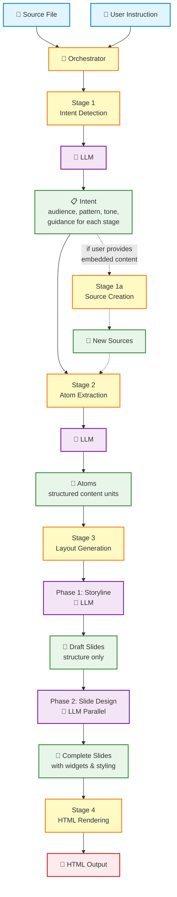
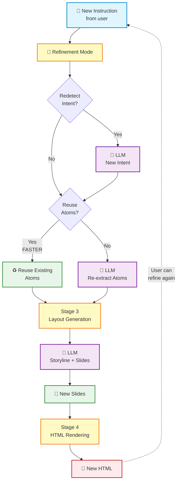
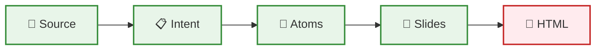
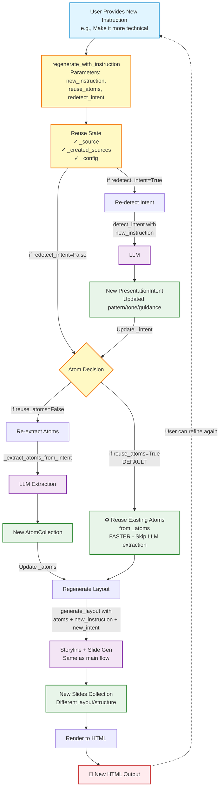
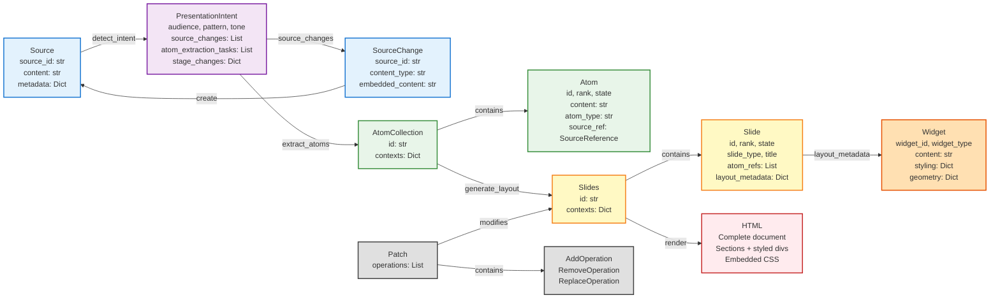
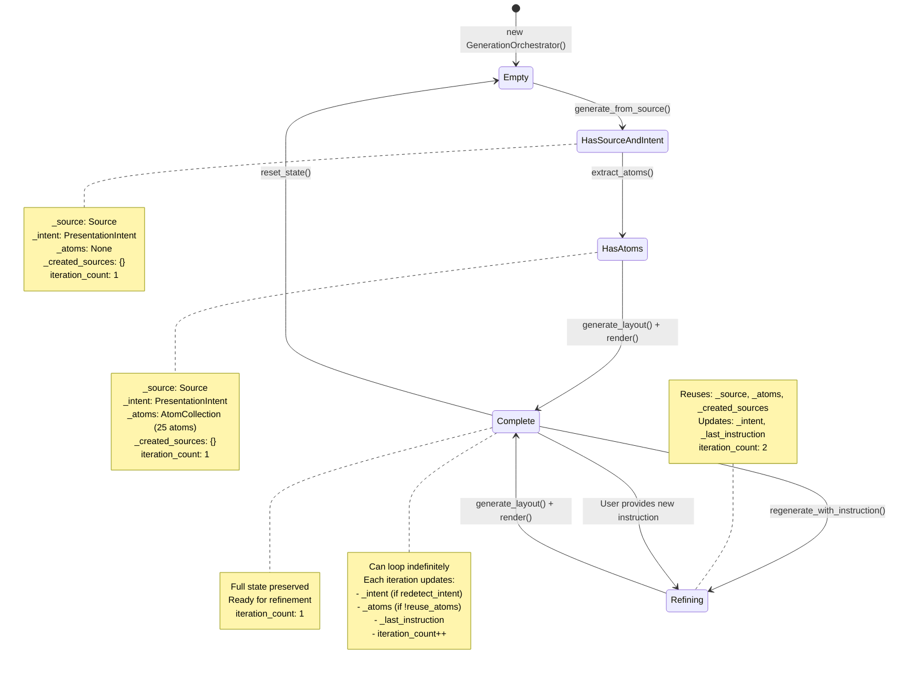
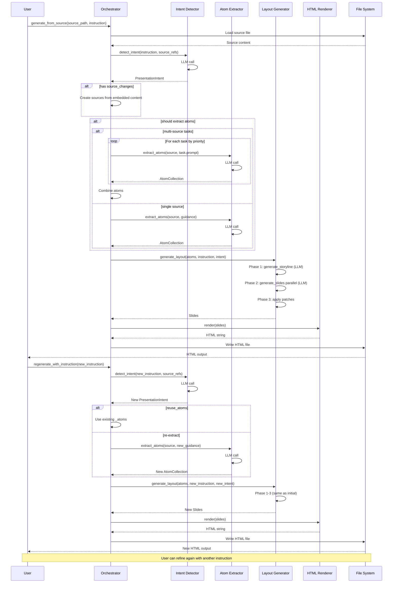

# Generation System Data Flow

This document illustrates the end-to-end data flow through the presentation generation system, including operations, data types, and the continuous refinement loop.

## Mermaid Diagram

### Simplified Generation Flow (Stages & Data)



### Simplified Refinement Loop



### Simplified Data Flow



### Detailed Diagrams

The following sections provide more detailed views of the system architecture.

<details>
<summary>Click to expand detailed diagrams</summary>

#### Main Generation Flow (Detailed)

```mermaid
graph TD
    %% Input Layer
    A1[Source File<br/>Path/Content] --> B1[Orchestrator]
    A2[User Instruction<br/>String] --> B1
    
    %% Orchestrator State
    B1[GenerationOrchestrator<br/>State: _source, _intent, _atoms,<br/>_created_sources, _config]
    
    %% Stage 1: Intent Detection
    B1 -->|generate_from_source| C1[STAGE 1: Intent Detection]
    C1 -->|detect_intent<br/>user_instruction + source_refs| C2[LLM Claude/GPT]
    C2 --> C3[PresentationIntent<br/>audience, pattern, tone<br/>source_changes<br/>atom_extraction_tasks<br/>stage_changes]
    C3 -->|Store in _intent| B1
    
    %% Stage 1a: Source Creation
    C3 -->|if source_changes exist| D1[STAGE 1a: Source Creation]
    D1 --> D2[For each SourceChange<br/>Create Source from<br/>embedded_content]
    D2 -->|Store in _created_sources| B1
    
    %% Stage 2: Atom Extraction
    D2 --> E1{Atom Extraction<br/>should_execute?}
    C3 --> E1
    E1 -->|Yes| E2{Multi-source or<br/>Single-source?}
    E1 -->|No| E8[Empty AtomCollection]
    
    E2 -->|atom_extraction_tasks exist| E3[Multi-Source Path]
    E2 -->|No tasks| E6[Single-Source Path]
    
    E3 --> E4[For each task by priority<br/>extract_atoms with<br/>task.extraction_prompt]
    E4 --> E5[LLM Extraction]
    E5 --> E7[Combine into<br/>AtomCollection]
    
    E6 --> E9[extract_atoms with<br/>atom_extraction_guidance]
    E9 --> E10[LLM Extraction]
    E10 --> E7
    
    E7 -->|Store in _atoms| B1
    E8 -->|Store in _atoms| B1
    
    %% Stage 3: Layout Generation
    E7 --> F1[STAGE 3: Layout Generation]
    E8 --> F1
    F1 --> F2[PHASE 1: Storyline]
    F2 -->|generate_storyline<br/>atoms + guidance| F3[LLM]
    F3 --> F4[Slides Collection<br/>Draft slides with<br/>atom_refs, no layouts]
    
    F4 --> F5[PHASE 2: Parallel<br/>Slide Generation]
    F5 --> F6[For each draft slide<br/>generate_slide]
    F6 --> F7[LLM per slide]
    F7 --> F8[Patch with<br/>ReplaceOperation<br/>Full layout_metadata]
    
    F8 --> F9[PHASE 3: Apply Patches]
    F9 --> F10[slides.patch<br/>Updates collection]
    F10 --> F11[Slides Collection<br/>Active slides with<br/>full layouts]
    
    %% Stage 4: Rendering
    F11 --> G1[STAGE 4: HTML Rendering]
    G1 --> G2[HTMLRenderer.render]
    G2 --> G3[For each slide<br/>For each widget<br/>Generate HTML elements]
    G3 --> G4[HTML Document<br/>Sections + styled divs]
    G4 --> G5[Write to output file]
    G5 --> H1[📄 HTML Output]
    
    %% Styling
    classDef inputClass fill:#e1f5ff,stroke:#0288d1,stroke-width:2px
    classDef orchestratorClass fill:#fff9c4,stroke:#f57f17,stroke-width:3px
    classDef llmClass fill:#f3e5f5,stroke:#7b1fa2,stroke-width:2px
    classDef dataClass fill:#e8f5e9,stroke:#388e3c,stroke-width:2px
    classDef outputClass fill:#ffebee,stroke:#c62828,stroke-width:2px
    
    class A1,A2 inputClass
    class B1 orchestratorClass
    class C2,E5,E10,F3,F7 llmClass
    class C3,D2,E7,E8,F4,F11 dataClass
    class H1 outputClass
```



#### Continuous Refinement Loop (Detailed)



#### Data Type Flow (Detailed)



#### State Management (Detailed)



#### Operation Sequence (Detailed)



</details>

## Key Concepts

### Four Main Stages

1. **Intent Detection** 🎯
   - Analyzes user instruction
   - Determines presentation type, audience, tone
   - Provides guidance for downstream stages

2. **Atom Extraction** 🧩
   - Breaks down source content into structured units
   - Can handle multiple sources
   - Creates reusable content atoms

3. **Layout Generation** 🎨
   - Creates slide structure (storyline)
   - Designs individual slides with widgets
   - Applies styling and positioning

4. **HTML Rendering** 📄
   - Converts slides to HTML
   - Applies final styling
   - Outputs viewable presentation

### Key Data Objects

- **Source** 📁 - Input document/content
- **Intent** 📋 - Understanding of user's goal
- **Atoms** 🧩 - Structured content pieces
- **Slides** 📑 - Presentation structure with layouts
- **HTML** 📄 - Final rendered output

### Continuous Refinement

Users can refine presentations iteratively:
- Provide new instruction without changing source
- Optionally reuse atoms for faster generation
- System maintains state between iterations
- Each refinement generates new slides and HTML

## ASCII Diagrams

<details>
<summary>Click to expand ASCII diagrams</summary>

### Complete Data Flow Diagram

```
┌─────────────────────────────────────────────────────────────────────────────┐
│                         USER INPUT & CONTEXT                                 │
│  ┌──────────────────┐        ┌──────────────────┐                          │
│  │ Source File      │        │ User Instruction │                          │
│  │ (Path/Content)   │        │ (String)         │                          │
│  └────────┬─────────┘        └────────┬─────────┘                          │
└───────────┼──────────────────────────┼────────────────────────────────────┘
            │                          │
            │                          │
┌───────────▼──────────────────────────▼────────────────────────────────────┐
│                    ORCHESTRATOR (GenerationOrchestrator)                    │
│  State:                                                                     │
│    • _source: Source | None                                                │
│    • _intent: PresentationIntent | None                                    │
│    • _atoms: AtomCollection | None                                         │
│    • _created_sources: Dict[str, Source]                                   │
│    • _config: GenerationConfig                                             │
│    • _last_instruction: str                                                │
└─────────────────────────────────────────────────────────────────────────────┘
            │
            │ First call: generate_from_source()
            ▼
┌─────────────────────────────────────────────────────────────────────────────┐
│ STAGE 1: INTENT DETECTION                                                   │
│                                                                              │
│  Input:  user_instruction (str), source_refs (List[str])                   │
│          ↓                                                                   │
│  detect_intent() ──→ LLM (Claude/GPT)                                       │
│          ↓                                                                   │
│  Output: PresentationIntent {                                               │
│    • audience: str                                                          │
│    • pattern: Literal["tutorial", "pitch", ...]                            │
│    • tone: Literal["professional", "casual", ...]                          │
│    • source_changes: List[SourceChange] {                                  │
│        - source_id: str                                                     │
│        - content_type: Literal["list", "data", "quote", "agenda"]          │
│        - embedded_content: str                                              │
│        - description: str                                                   │
│      }                                                                       │
│    • atom_extraction_tasks: List[AtomExtractionTask] {                     │
│        - source_ref: str                                                    │
│        - extraction_prompt: str                                             │
│        - priority: int (1=highest)                                          │
│        - requires_source_creation: bool                                     │
│      }                                                                       │
│    • stage_changes: Dict[str, StageChange] {                               │
│        "atom_extraction": { should_execute, guidance, parameters }         │
│        "storyline": { should_execute, guidance, parameters }               │
│        "slide_generation": { should_execute, guidance, parameters }        │
│        "theme": { should_execute, guidance, parameters }                   │
│        "preset": { should_execute, guidance, parameters }                  │
│      }                                                                       │
│    • atom_extraction_guidance: str                                          │
│    • storyline_guidance: str                                                │
│    • slide_generation_guidance: str                                         │
│  }                                                                           │
│                                                                              │
│  Stored in: orchestrator._intent                                            │
└──────────────────────────────────────────────────────────────────────────────┘
            │
            │ if source_changes detected
            ▼
┌─────────────────────────────────────────────────────────────────────────────┐
│ STAGE 1a: SOURCE CREATION (Conditional)                                     │
│                                                                              │
│  For each SourceChange in intent.source_changes:                           │
│    Input:  SourceChange { source_id, content_type, embedded_content }      │
│            ↓                                                                 │
│    Create: Source {                                                         │
│      • source_id: str                                                       │
│      • content: str (from embedded_content)                                 │
│      • metadata: Dict[str, Any]                                             │
│    }                                                                         │
│            ↓                                                                 │
│  Stored in: orchestrator._created_sources[source_id] = Source              │
└──────────────────────────────────────────────────────────────────────────────┘
            │
            │ if stage_changes["atom_extraction"].should_execute == True
            ▼
┌─────────────────────────────────────────────────────────────────────────────┐
│ STAGE 2: ATOM EXTRACTION                                                    │
│                                                                              │
│  Branch A: Multi-Source Extraction (if atom_extraction_tasks exists)       │
│  ┌────────────────────────────────────────────────────────────────────┐   │
│  │ For each AtomExtractionTask (sorted by priority):                  │   │
│  │   Input:  Source (from _source or _created_sources)                │   │
│  │           task.extraction_prompt (str)                              │   │
│  │           ↓                                                          │   │
│  │   extract_atoms() ──→ LLM (Claude/GPT)                             │   │
│  │           ↓                                                          │   │
│  │   Output: AtomCollection {                                          │   │
│  │     id: str                                                          │   │
│  │     contexts: Dict[str, Atom] where Atom = {                        │   │
│  │       • id: str                                                      │   │
│  │       • rank: int                                                    │   │
│  │       • state: PatchableContextState                                │   │
│  │       • content: str                                                 │   │
│  │       • atom_type: str (e.g., "statement", "process", "comparison") │   │
│  │       • source_ref: SourceReference { source_id, content_hash }     │   │
│  │       • metadata: Dict[str, Any]                                     │   │
│  │     }                                                                 │   │
│  │   }                                                                   │   │
│  │           ↓                                                          │   │
│  │   Combine into combined_atoms using:                                │   │
│  │   combined_atoms.patch(Patch(operations=[AddOperation(add=atom)])) │   │
│  └────────────────────────────────────────────────────────────────────┘   │
│                                                                              │
│  Branch B: Single-Source Extraction (fallback)                             │
│  ┌────────────────────────────────────────────────────────────────────┐   │
│  │ Input:  Source, atom_extraction_guidance (str)                      │   │
│  │         ↓                                                            │   │
│  │ extract_atoms() ──→ LLM                                             │   │
│  │         ↓                                                            │   │
│  │ Output: AtomCollection (same structure as above)                    │   │
│  └────────────────────────────────────────────────────────────────────┘   │
│                                                                              │
│  Stored in: orchestrator._atoms                                             │
└──────────────────────────────────────────────────────────────────────────────┘
            │
            │ Pass atoms + guidance to layout generation
            ▼
┌─────────────────────────────────────────────────────────────────────────────┐
│ STAGE 3: LAYOUT GENERATION (generate_layout)                               │
│                                                                              │
│  Input:  AtomCollection, user_instruction, PresentationIntent              │
│          ↓                                                                   │
│  ┌───────────────────────────────────────────────────────────────────┐    │
│  │ PHASE 1: STORYLINE GENERATION                                      │    │
│  │                                                                     │    │
│  │  Input:  atoms, intent.storyline_guidance                          │    │
│  │          ↓                                                          │    │
│  │  generate_storyline() ──→ LLM (Claude/GPT)                        │    │
│  │          ↓                                                          │    │
│  │  Output: Slides {                                                   │    │
│  │    id: str                                                          │    │
│  │    contexts: Dict[str, Slide] where Slide = {                      │    │
│  │      • id: str                                                      │    │
│  │      • rank: int (slide order)                                     │    │
│  │      • state: PatchableContextState (draft)                        │    │
│  │      • slide_type: str                                              │    │
│  │      • title: str                                                   │    │
│  │      • atom_refs: List[str] (references to atoms)                  │    │
│  │      • layout_metadata: Dict (empty at this stage)                 │    │
│  │    }                                                                 │    │
│  │  }                                                                   │    │
│  └─────────────────────────────────────────────────────────────────────┘    │
│          ↓                                                                   │
│  ┌───────────────────────────────────────────────────────────────────┐    │
│  │ PHASE 2: PARALLEL SLIDE GENERATION                                 │    │
│  │                                                                     │    │
│  │  For each draft Slide in parallel:                                 │    │
│  │    Input:  Slide (draft), referenced Atoms, intent guidance        │    │
│  │            ↓                                                        │    │
│  │    generate_slide() ──→ LLM (Claude/GPT)                          │    │
│  │            ↓                                                        │    │
│  │    Output: Patch {                                                  │    │
│  │      operations: [ReplaceOperation {                               │    │
│  │        replace: Slide {                                             │    │
│  │          id, rank, state: "active"                                 │    │
│  │          layout_metadata: {                                         │    │
│  │            widgets: List[Widget] {                                  │    │
│  │              • widget_id: str                                       │    │
│  │              • widget_type: str (text_block, heading, list, ...)   │    │
│  │              • content: str                                         │    │
│  │              • styling: Dict (font, color, alignment, ...)         │    │
│  │              • geometry: Dict (x, y, width, height, z_index)       │    │
│  │            }                                                         │    │
│  │            canvas: { width, height, background }                   │    │
│  │            theme_ref: str                                           │    │
│  │          }                                                           │    │
│  │        }                                                             │    │
│  │      }]                                                              │    │
│  │    }                                                                 │    │
│  └─────────────────────────────────────────────────────────────────────┘    │
│          ↓                                                                   │
│  ┌───────────────────────────────────────────────────────────────────┐    │
│  │ PHASE 3: APPLY PATCHES                                             │    │
│  │                                                                     │    │
│  │  For each Patch:                                                    │    │
│  │    slides.patch(patch)  # Updates Slides collection                │    │
│  │                                                                     │    │
│  │  Output: Slides (with all slides in "active" state + full layouts) │    │
│  └─────────────────────────────────────────────────────────────────────┘    │
│                                                                              │
│  Return: Slides                                                             │
└──────────────────────────────────────────────────────────────────────────────┘
            │
            │
            ▼
┌─────────────────────────────────────────────────────────────────────────────┐
│ STAGE 4: HTML RENDERING                                                     │
│                                                                              │
│  Input:  Slides                                                             │
│          ↓                                                                   │
│  HTMLRenderer.render()                                                      │
│          ↓                                                                   │
│  For each Slide in slides.list_contexts():                                 │
│    For each Widget in slide.layout_metadata.widgets:                       │
│      Generate HTML element with:                                            │
│        • Positioning (absolute, based on geometry)                          │
│        • Styling (fonts, colors, from widget.styling)                      │
│        • Content (widget.content)                                           │
│          ↓                                                                   │
│  Output: HTML (str) {                                                       │
│    • Complete HTML document                                                 │
│    • Embedded CSS styles                                                    │
│    • One <section> per slide                                               │
│    • Widgets as <div> elements with inline styles                          │
│  }                                                                           │
│                                                                              │
│  Write to: output_file.html                                                 │
└──────────────────────────────────────────────────────────────────────────────┘
            │
            │
            ▼
┌─────────────────────────────────────────────────────────────────────────────┐
│                           OUTPUT: HTML FILE                                  │
│  Rendered presentation ready for viewing in browser                         │
└──────────────────────────────────────────────────────────────────────────────┘


═══════════════════════════════════════════════════════════════════════════════
                        CONTINUOUS REFINEMENT LOOP
═══════════════════════════════════════════════════════════════════════════════

After initial generation, user can provide new instructions without new context:

┌─────────────────────────────────────────────────────────────────────────────┐
│                      USER PROVIDES NEW INSTRUCTION                           │
│  Example: "Make it more technical with code examples"                      │
└────────────────────────────────┬────────────────────────────────────────────┘
                                 │
                                 ▼
┌─────────────────────────────────────────────────────────────────────────────┐
│              ORCHESTRATOR.regenerate_with_instruction()                     │
│                                                                              │
│  State Reuse (from previous generation):                                   │
│    ✓ _source (original Source)                                             │
│    ✓ _created_sources (any user-provided sources)                          │
│    ✓ _atoms (optionally reused or re-extracted)                            │
│    ✓ _config (GenerationConfig)                                            │
│                                                                              │
│  Parameters:                                                                 │
│    • new_instruction: str                                                   │
│    • reuse_atoms: bool (default=True)                                      │
│    • redetect_intent: bool (default=True)                                  │
└─────────────────────────────────────────────────────────────────────────────┘
            │
            │ if redetect_intent == True
            ▼
┌─────────────────────────────────────────────────────────────────────────────┐
│ STEP 1: RE-DETECT INTENT                                                    │
│                                                                              │
│  Input:  new_instruction, existing source_refs                             │
│          ↓                                                                   │
│  detect_intent() ──→ LLM                                                   │
│          ↓                                                                   │
│  Output: PresentationIntent (new, reflects new instruction)                │
│          ↓                                                                   │
│  Update: orchestrator._intent = new_intent                                  │
│          orchestrator._last_instruction = new_instruction                   │
└──────────────────────────────────────────────────────────────────────────────┘
            │
            │ if reuse_atoms == False
            ▼
┌─────────────────────────────────────────────────────────────────────────────┐
│ STEP 2a: RE-EXTRACT ATOMS (Optional)                                       │
│                                                                              │
│  Same as STAGE 2 above, using new intent guidance                          │
│  Output: New AtomCollection                                                 │
│          ↓                                                                   │
│  Update: orchestrator._atoms = new_atoms                                    │
└──────────────────────────────────────────────────────────────────────────────┘
            │
            │ if reuse_atoms == True (default)
            ▼
┌─────────────────────────────────────────────────────────────────────────────┐
│ STEP 2b: REUSE EXISTING ATOMS                                              │
│                                                                              │
│  Use: orchestrator._atoms (from previous generation)                        │
│  Benefits:                                                                   │
│    • Faster regeneration (skip LLM extraction)                             │
│    • Consistent content atoms                                               │
│    • Only storyline and layout change                                       │
└──────────────────────────────────────────────────────────────────────────────┘
            │
            │
            ▼
┌─────────────────────────────────────────────────────────────────────────────┐
│ STEP 3: REGENERATE LAYOUT                                                   │
│                                                                              │
│  Input:  Reused/new atoms, new_instruction, new intent                     │
│          ↓                                                                   │
│  generate_layout() ──→ Same as STAGE 3 above                               │
│          ↓                                                                   │
│  Output: Slides (new layout reflecting new instruction)                    │
└──────────────────────────────────────────────────────────────────────────────┘
            │
            │
            ▼
┌─────────────────────────────────────────────────────────────────────────────┐
│ STEP 4: RENDER NEW HTML                                                     │
│                                                                              │
│  Same as STAGE 4 above                                                      │
│  Output: New HTML file                                                      │
└──────────────────────────────────────────────────────────────────────────────┘
            │
            │
            ▼
┌─────────────────────────────────────────────────────────────────────────────┐
│                    LOOP: USER CAN REFINE AGAIN                              │
│  Provide another new_instruction → regenerate_with_instruction()           │
│  Continue iterating until satisfied                                         │
└─────────────────────────────────────────────────────────────────────────────┘


═══════════════════════════════════════════════════════════════════════════════
                            STATE MANAGEMENT
═══════════════════════════════════════════════════════════════════════════════

Orchestrator State Tracking:

┌─────────────────────────────────────────────────────────────────────────────┐
│ orchestrator.get_current_state() returns:                                   │
│   {                                                                          │
│     "has_source": bool,                                                     │
│     "source_id": str | None,                                                │
│     "created_sources": List[str],  # IDs of user-provided sources          │
│     "has_intent": bool,                                                     │
│     "intent_pattern": str | None,  # e.g., "tutorial"                      │
│     "atoms_count": int,            # Number of atoms in collection          │
│     "last_instruction": str        # Most recent user instruction           │
│   }                                                                          │
└─────────────────────────────────────────────────────────────────────────────┘

┌─────────────────────────────────────────────────────────────────────────────┐
│ orchestrator.reset_state()                                                   │
│   • Clears all state variables (_source, _intent, _atoms, etc.)            │
│   • Resets iteration_count to 0                                             │
│   • Allows starting fresh generation                                        │
└─────────────────────────────────────────────────────────────────────────────┘


═══════════════════════════════════════════════════════════════════════════════
                         KEY DATA TYPE SUMMARY
═══════════════════════════════════════════════════════════════════════════════

1. Source (input context)
   - source_id: str
   - content: str
   - metadata: Dict[str, Any]

2. PresentationIntent (LLM output from user instruction)
   - audience, pattern, tone: str
   - source_changes: List[SourceChange]
   - atom_extraction_tasks: List[AtomExtractionTask]
   - stage_changes: Dict[str, StageChange]
   - guidance fields: str (for each stage)

3. AtomCollection (structured content units)
   - id: str
   - contexts: Dict[str, Atom]
   - Methods: patch(), list_contexts(), get_by_source(), get_by_type()

4. Slides (presentation structure)
   - id: str
   - contexts: Dict[str, Slide]
   - Methods: patch(), list_contexts(), filter by state

5. Slide (individual slide with layout)
   - id, rank, state: str/int/PatchableContextState
   - slide_type, title: str
   - atom_refs: List[str]
   - layout_metadata: { widgets: List[Widget], canvas: Dict, theme_ref: str }

6. Widget (visual element on slide)
   - widget_id, widget_type: str
   - content: str
   - styling: Dict (fonts, colors, alignment)
   - geometry: Dict (x, y, width, height, z_index)

7. Patch (modification operations)
   - operations: List[AddOperation | RemoveOperation | ReplaceOperation]

8. HTML (final output)
   - Complete HTML document string
   - Embedded CSS for styling
   - Absolute-positioned widgets per slide

</details>

